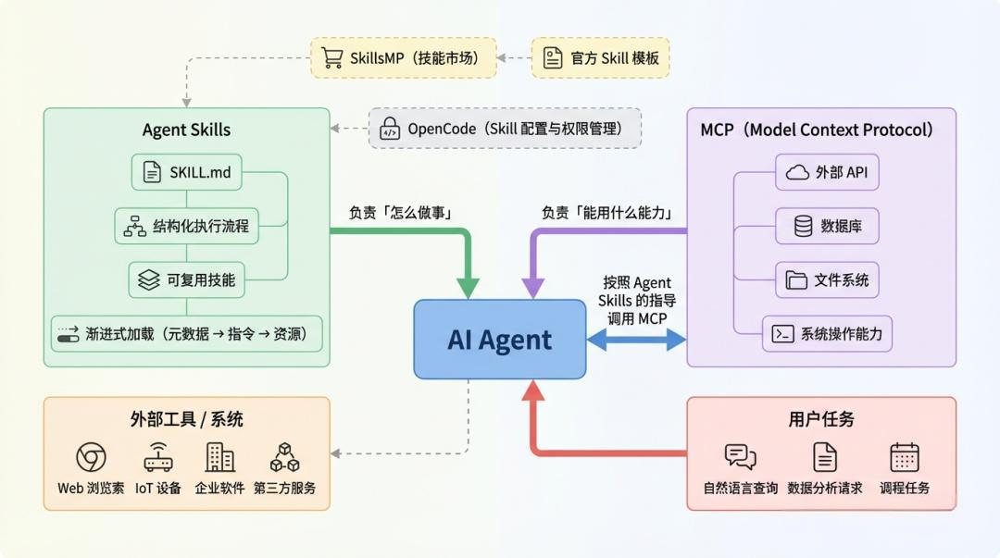
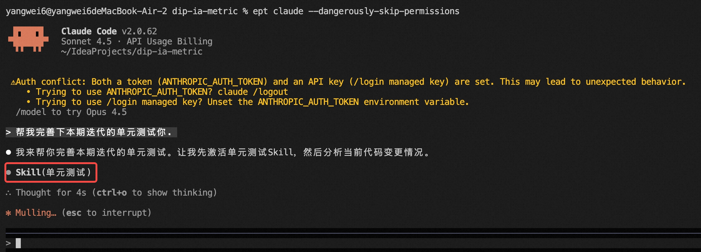
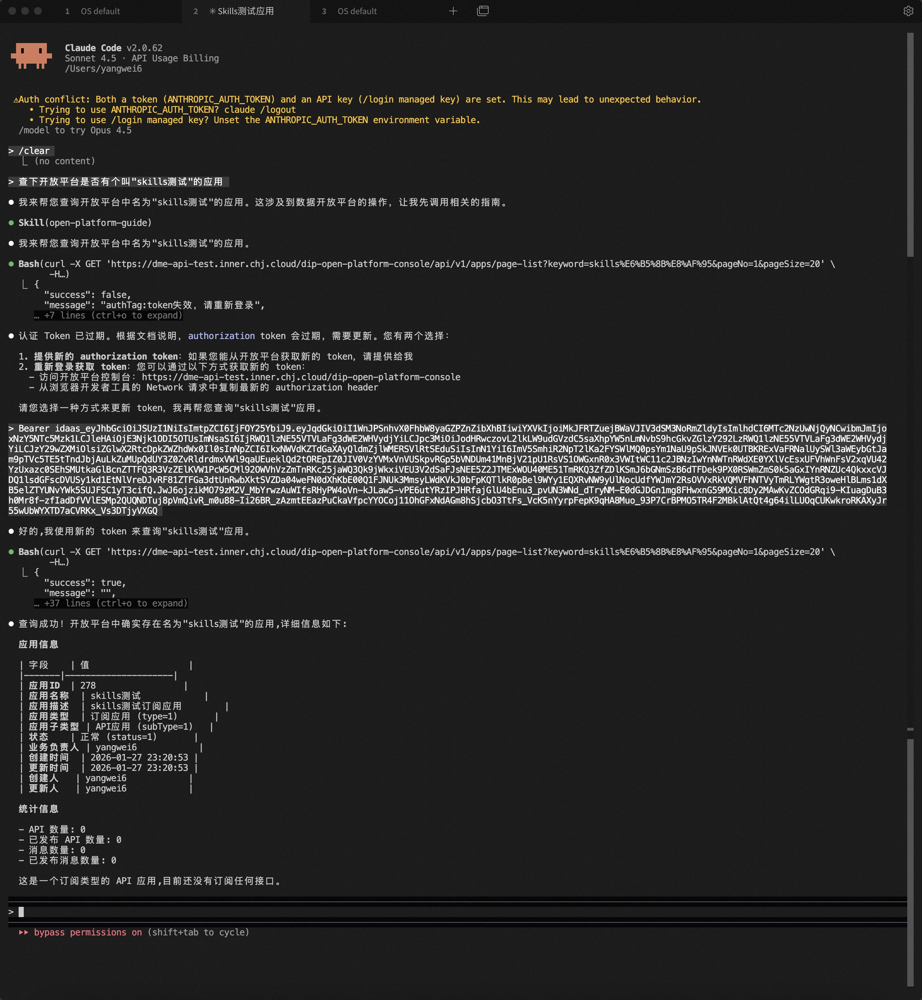
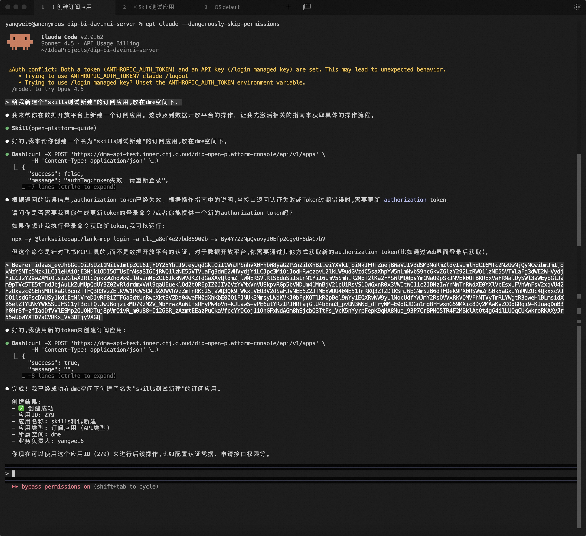
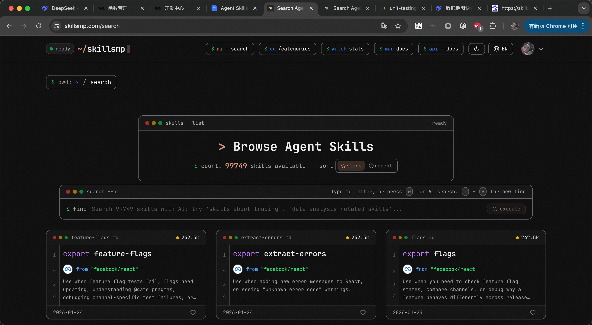
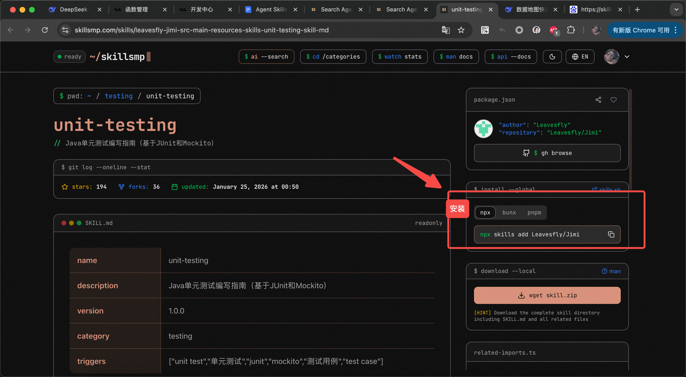

## 预期收益：

> - 理解 Agent Skills 解决的核心问题：模型很聪明，但输出不稳定；
> - 掌握 Agent Skills 的标准化定义与规范；
> - 学会在实际项目中配置和使用 Skills；

## 一、Why Agent Skills

### 常见问题

如果你最近在折腾 AI Agent，很可能已经遇到过下面几种情况：

> - 模型很聪明，但输出不稳定；
> - Prompt 越写越长，效果却越来越玄学，幻觉率高；
> - 接了 MCP、Tool，Agent 还是不知道"该怎么专业地做事"；

这些问题的问题不在模型，也不在工具，而在于：**Agent 缺的不是能力，而是「做事方法」。**

### Prompt + Tool 的局限性

#### 1️⃣ Prompt 的天然问题

Prompt 解决的是：**「这一轮你该怎么回答」**，但解决不了：**「以后遇到类似问题，你应该一直怎么做」。**

核心痛点：

> - 一次性上下文，用完即丢
> - 难以复用，难以版本管理
> - 多个 Prompt 组合时极易互相干扰

#### 2️⃣ Tool / MCP 的能力边界

> - Tool 解决的是：**能做什么**
> - MCP 解决的是：**怎么接入外部能力**
> - API、数据库、文件系统，全都打通了

但它们不负责一件事：**事情应该按什么流程来做！**

### Agent Skills 补上的那一层

Agent Skills 解决的是：**长期、稳定、可复用的「做事方法论」**

一句话总结三者分工：

| 维度 | Prompt | Tool / MCP | Agent Skills |
|------|--------|------------|--------------|
| 解决问题 | 这一轮怎么说 | 能干什么 | 长期应该怎么干 |
| 聚焦 | 单次响应 | 外部能力 | 行为规范与方法 |
| 复用性 | 低 | 中 | 高 |



## 二、What Agent Skills

### 定义

**Agent Skills 是一套「教 Agent 怎么做事」的****标准化技能说明书****。**

它不是 Prompt，也不是 Tool，而是介于两者之上的一层：
- 有明确使用场景；
- 有固定执行流程；
- 有稳定输出标准；
- 可复用；

可以把它理解为：👉 给 Agent 配的一本「岗位技能手册」。

> 不是临时交代任务，而是明确告诉它：
> "这类事，你应该一直这样做。"

### 与 MCP 的关系

一句话区分：**MCP 解决「能用什么能力」，Agent Skills 解决「怎么用这些能力」。**

| 对比项 | Agent Skills | MCP |
|--------|-------------|-----|
| 关注点 | 做事方法 | 外部能力 |
| 本质 | 行为与决策规范 | API / 数据 / 系统 |

一个好理解的比喻：
- MCP 是工具箱
- Agent Skills 是使用说明书

### 文件结构

从官方规范看，一个 Skill 至少是一个文件夹：

```plaintext
skill-name/
├── SKILL.md              # 主要说明（触发时加载）
├── FORMS.md              # 表单填充指南（根据需要加载）
├── reference.md          # API 参考（根据需要加载）
├── examples.md           # 使用示例（根据需要加载）
└── scripts/
    ├── analyze_form.py   # 实用脚本（执行，不加载）
    ├── fill_form.py      # 表单填充脚本
    └── validate.py       # 验证脚本
```

其中，**SKILL.md 是灵魂**。
它定义的不是「回答格式」，而是：**一整套可执行的行为流程**。

### Token 优化机制

Agent Skills 采用**渐进式加载机制**，特别省 Token：

1. 启动时：只加载 name + description
2. 判断匹配时：加载完整 SKILL.md
3. 执行过程中：再按需加载脚本或资源

结果：
- 不污染上下文
- 不浪费 Token
- Agent 更容易选对技能

## 三、How Agent Skills

### SKILL.md 官方模板

#### 1️⃣ 最小可用模板

```yaml
---
name: example-skill
description: 简要说明该技能的用途和适用场景
---

## 使用场景
说明在什么情况下应该使用这个 Skill。

## 执行步骤
1. 第一步要做什么
2. 第二步要做什么
3. 异常情况如何处理

## 输出要求
说明输出格式或必须包含的内容。
```

Agent Skills 的核心思想：**不是告诉模型「怎么回答」，而是规定「事情要怎么做」**。

#### 2️⃣ 更推荐的实战模板

```yaml
---
name: security-log-analysis
description: 对安全日志进行结构化分析，判断是否存在异常行为
metadata:
  version: 1.0
  author: yangwei6
---

## 技能目标
明确这个 Skill 希望 Agent 达成的目标。

## 输入说明
- 支持的输入类型
- 必须包含的字段

## 执行流程
1. 识别数据类型
2. 提取关键字段
3. 进行规则或逻辑判断
4. 输出分析结论

## 输出格式
- 是否异常：
- 判断依据：
- 风险说明：
- 建议动作：

## 注意事项
- 无法确认时必须说明不确定性
- 禁止空泛总结
```

### 在项目中配置 Skill

#### 1️⃣ Skill 放在哪？

系统会自动扫描以下目录：

| 位置 | 路径 | 说明 |
|------|------|------|
| 项目级（推荐） | `<workspace-root>/.claude/skills/` | 项目专属技能 |
| 全局级 | `~/.claude/skills/` | 所有项目可用 |

#### 2️⃣ Skill 规范要求

- 文件名必须是 **SKILL.md**
- name 必须**小写**，和目录名一致
- 必须包含 **description**

⚠️ 最常见的坑：
**name 和目录名不一致，Skill 可能会失效。**

#### 3️⃣ Skill 权限控制（可选）

在配置文件中可以精确控制哪些 Skill 能被 Agent 使用：

```json
{
  "skills": {
    "code-reviewer": {
      "permissions": {
        "network": false,
        "read": true,
        "write": false
      }
    }
  }
}
```

权限配置文件位置：

| 位置 | 路径 | 说明 |
|------|------|------|
| 项目级（推荐） | `<workspace-root>/.claude/settings.local.json` | 项目专属技能 |
| 全局级 | `~/.claude/settings.local.json` | 所有项目可用 |

## 四、实战案例

### 案例1：单元测试 Skill

#### SKILL.md 内容示例

> 附件：SKILL.md（见飞书原文档）

**Claude Code 自动激活**：



### 案例2：接入开放平台 demo

#### 实现思路

基于此完成了一个查询和新建开放平台应用的简易 demo 示例。

#### 效果

| 查询数据 | 新增数据 |
|---------|---------|
|  |  |

#### SKILL.md 内容示例

> 附件：SKILL.md（见飞书原文档）

## 五、官方资源与生态

### 资源链接

| 资源类型 | 链接 | 说明 |
|---------|------|------|
| Agent Skills 规范 | https://agentskills.io/home | 官方标准文档 |
| SkillsMP 市场 | https://skillsmp.com | Agent Skills 市场 |
| 官方入门指南 | https://code.claude.com/docs/zh-CN/skills | 如何开始使用 |
| 官方概览 | https://platform.claude.com/docs/zh-CN/agents-and-tools/agent-skills/overview | Agent Skills 详解 |
| 官方开源 Skills | https://github.com/anthropics/skills | 官方提供的 Skills 库 |
| 画图 Skills | https://github.com/kepano/obsidian-skills | |

### SkillsMP 市场

在 SkillsMP 你可以：
- 看别人怎么写 Skill
- 直接复用成熟 Skill
- 快速建立自己的技能库

| Skills 市场 | 安装 |
|------------|------|
|  |  |

## 六、总结

Agent Skills 不是让模型更聪明，而是让 Agent 更像一个**「真正会干活的专业员工」**。

如果你已经在做 Agent，不妨从一个最小 Skill 开始，把你最常用、最稳定的一段 Prompt，升级成 Agent Skill。
