> 预期收益：
> 1. What MCP：了解MCP及其相关概念；
> 2. How MCP：
>    1. 如何接入开源MCP server
>    2. 基于自身业务场景，如何自定义一个MCP Server及Client并接入LLM；【python/Java】

# 一、What is MCP

MCP（Model Context Protocol，模型上下文协议），2024年11月底，由 **Anthropic** 推出的一种开放标准，旨在统一大型语言模型（LLM）与外部数据源和工具之间的通信协议。MCP 的主要目的在于解决当前 AI 模型因数据孤岛限制而无法充分发挥潜力的难题，MCP 使得 AI 应用能够访问和操作本地及远程数据，为 AI 应用提供了连接万物的接口。

| 形象比喻 | 整体结构图 |
|---------|---------|
| 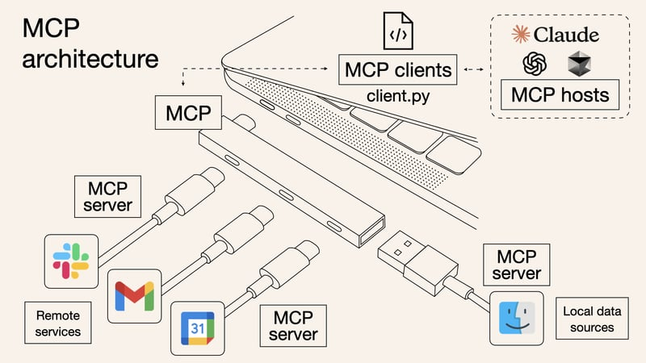 | 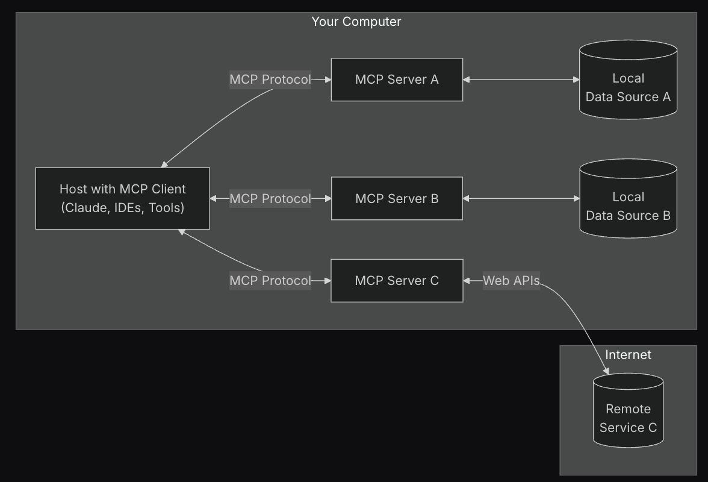 |

## 核心概念

1. **Host**：一个应用（主机）（可能是IDE, Claude Desktop等类型）可以包含多个客户端；
2. **MCP Client**：一个客户端只会连接一个服务器，通过mcp协议交互；
3. **MCP Server**：服务端可以访问本地/远程数据源，提供工具和提示词给客户端

> 注意：client和server是一个逻辑概念，它们的实现不局限于编程语言，目前MCP协议官方提供Python、Node.js、Java、C#、Kotlin的SDK。

## 能力展示示例

### 接入文件系统

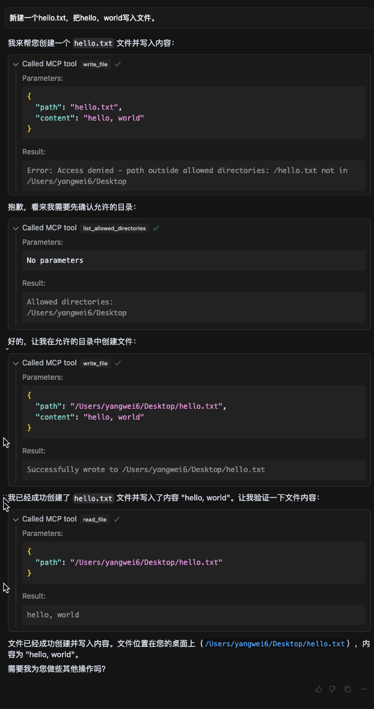

### 接入Git

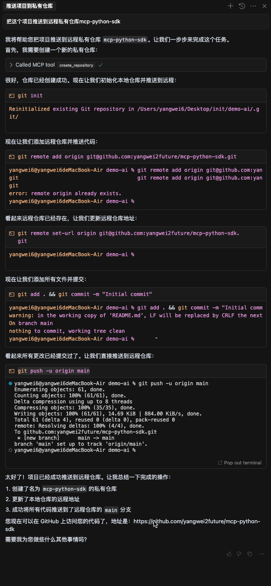

### 接入数据库

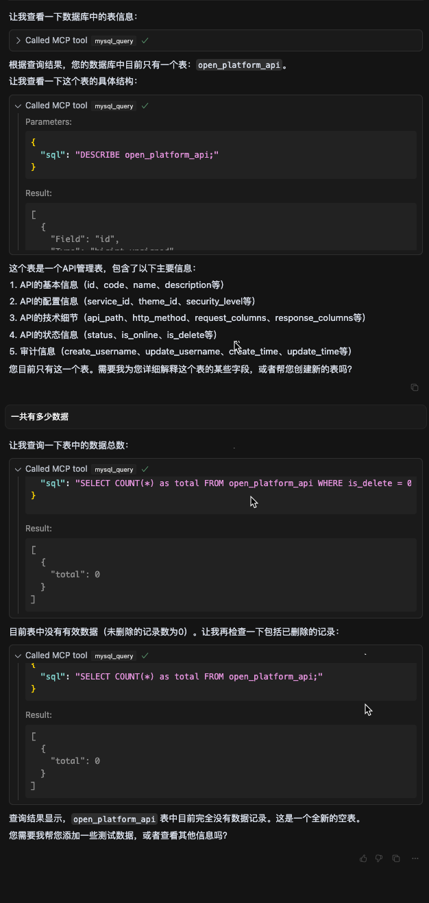

### 接入浏览器

> 视频文件：屏幕录制2025-04-09 00.28.27.mov（飞书原文档查看）

# 二、How MCP

## 接入开源的MCP Server

> [社区](https://github.com/punkpeye/awesome-mcp-servers/blob/main/README-zh.md)有非常多开源的 [MCP server](https://mcp.so/)，配置完环境之后可无缝接入，成本极低；
> 接入方式通常有两种：
> 1. 直接接入官方已部署好的server服务器，例如[文件系统](https://github.com/modelcontextprotocol/servers/tree/main/src/filesystem)。
> 2. 将对应MCP server源码下载进行编译后到一个结果文件，将该文件写入MCP配置文件。例如[apple-script](https://github.com/joshrutkowski/applescript-mcp)（一个接入mac功能的MCP，可通过对话方式直接打开微信等应用）。

以cursor接入[文件系统](https://github.com/modelcontextprotocol/servers/tree/main/src/filesystem)为例，如果我们使用官方已经部署好的mcp server，那么我们仅需要在MCP服务器的配置中加入对应文件系统的配置即可。

| 配置文件 | 连接状态展示 |
|---------|------------|
| 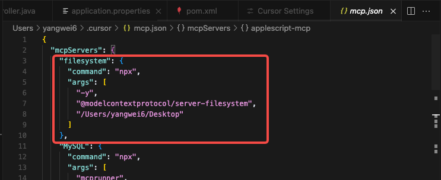 | 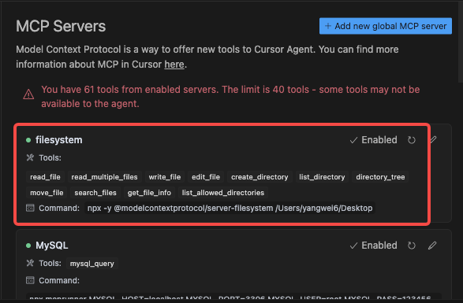 |

## 自定义 MCP Server

> Spring-AI在MCP官方的Java SDK又做了一层集成，并封装了对应starter，引入之后可简化开发流程，注意以下几个常见踩坑点：
> 1. MCP需Java17及以上版本；
> 2. 如使用maven项目，版本需要3.6.3及以上；
> 3. starter未在阿里云镜像仓库中，需要指定仓库；

### 本地Server

> 说明：本地server相当于服务端跑在本机上，并通过stdio(标准输入输出流)与client进行通信；
> 此处分为以下两部进行演示：
> 1. 基于Java的本地MCP Server实现流程；
> 2. 自定义MCP Server接入IDE流程；
>
> 同理可参考对应其他语言开发文档进行对应的实现；
> 源码地址：[本地server](https://github.com/yangwei2future/MCP-server)

参考文档：
1. [MCP官方开发文档](https://modelcontextprotocol.io/quickstart/server)
2. [MCP官方实现用例](https://github.com/modelcontextprotocol/java-sdk)
3. [Spring AI集成MCP Java SDK使用文档](https://docs.spring.io/spring-ai/reference/api/mcp/mcp-server-boot-starter-docs.html)

**自定义MCP server实现**

1. 搭建一个基础的Spring脚手架项目，中台已有相关沉淀；
2. 引入相关依赖，一个是mcp-server依赖，一个是web依赖；

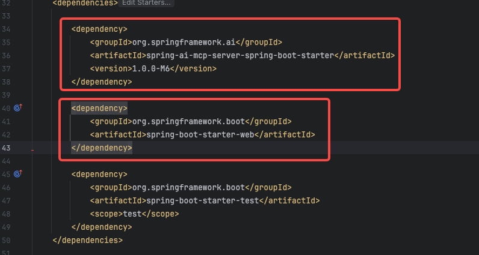

3. 调整配置文件。

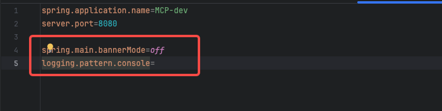

4. 新建一个service，将【业务逻辑】包在方法中，并标识为工具；

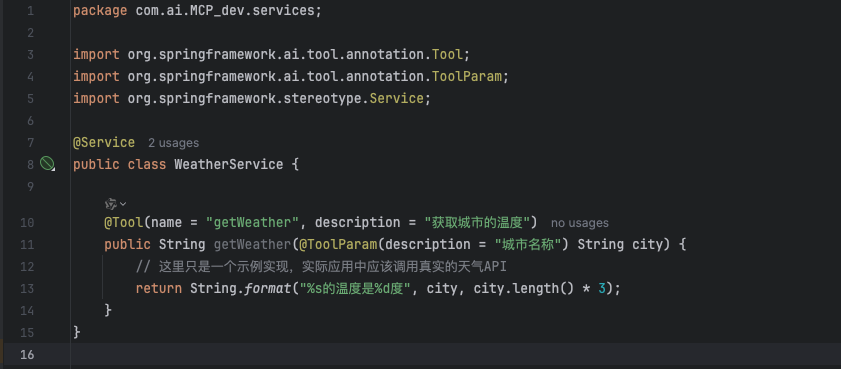

5. 新建一个provider（工具提供类），将工具加入进去，此时MCP server开发工作就结束了；

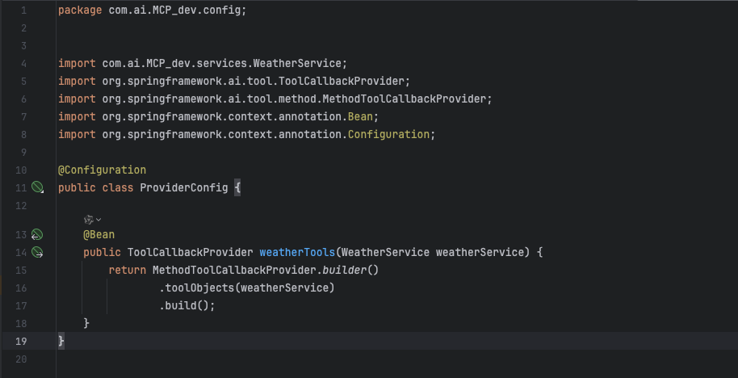

6. 对整个项目进行打包，得到server的jar包。

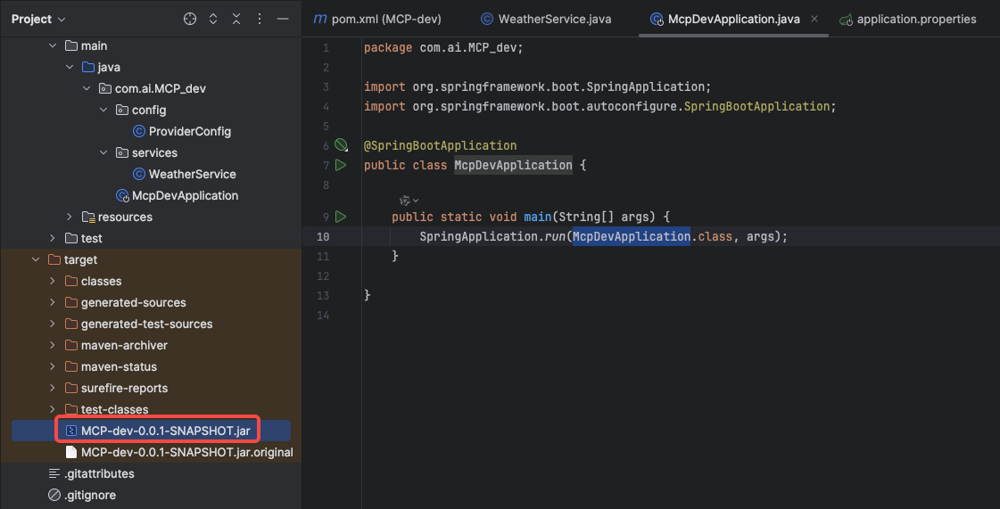

**自定义MCP server接入IDE**

> 演示cherry-studio接入自定义MCP服务器的方式，原因有两点：
> 1. 由于cursor不支持Java版本server；
> 2. claude仅支持其公司模型，需要外网登录 + 国外手机号，不便于调试；

配置信息如下：

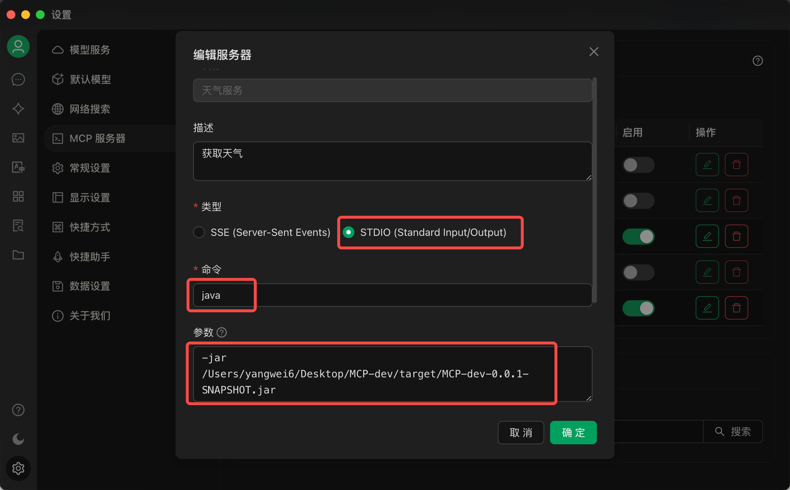

**验证**：

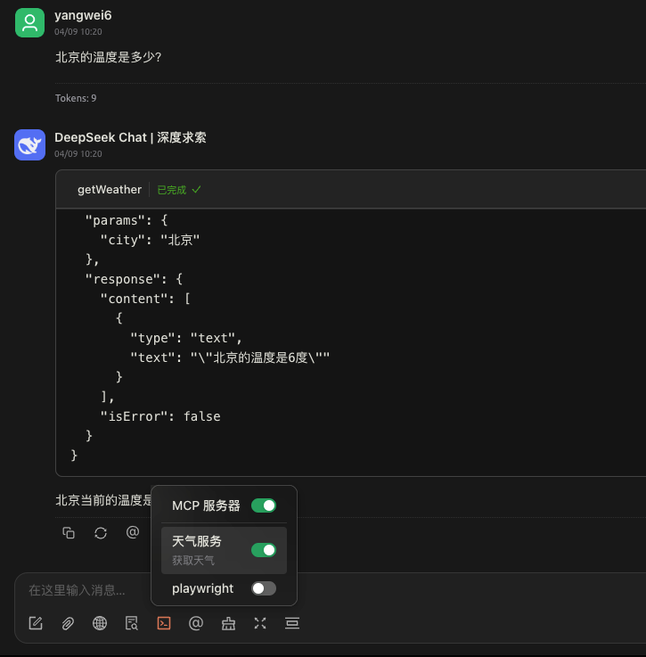

### 远程Server

**自定义MCP server实现**

相比于本地的server实现，变更点为依赖的调整，具体变更如下：
1. server调整为mvc的依赖；
2. 去除原来spring-web-mvc依赖；

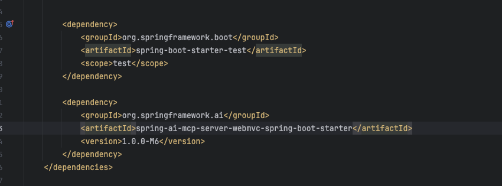

**自定义MCP server接入IDE**

1. 需启动远程MCP服务器；
2. MCP server配置中类型选SSE，同时URL配置对应服务地址即可（需加入 `/sse` 后缀）

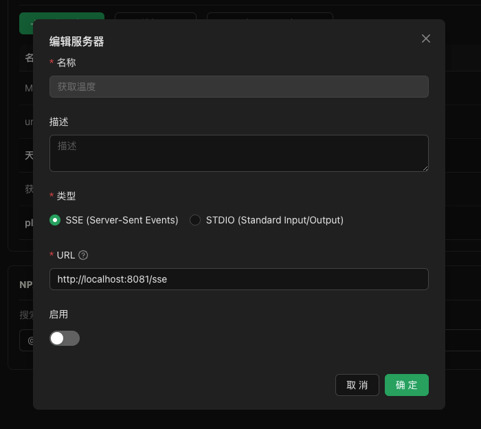

验证：

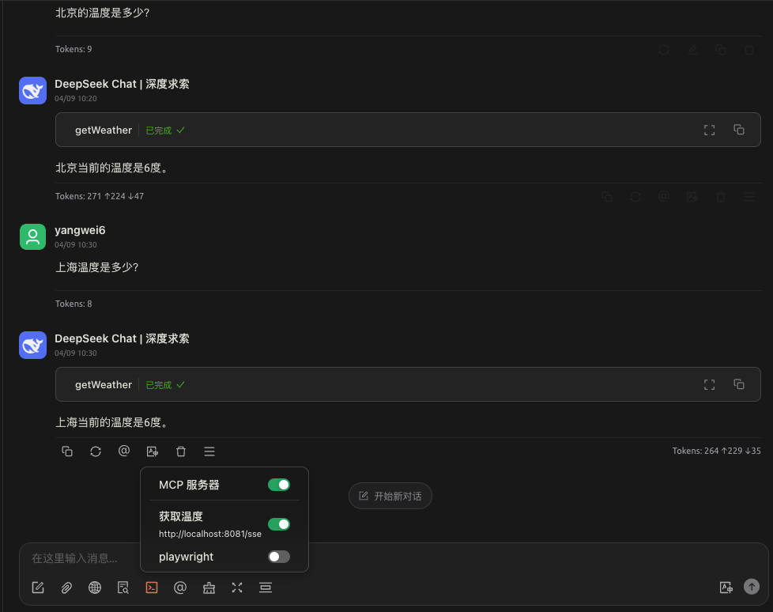

## LLM接入自定义MCP Server及Client

> 写在前面：
> 如果依赖于IDE工具做AI开发，通常来说IDE支持MCP之后，隐式的含义为他们把对应client的工具完成了，用户如需扩展能力，仅需完成MCP server的开发即可；
> 但实际的开发过程中，并非与某个IDE完全绑定，于是需要自定义 MCP client实现，并与LLM进行接入；

1. 相关依赖及配置：deepseek相关依赖 + mcp client依赖

> 因为deepseek接口规范遵循openai，因此引入了openai对应starter实现，如果需要更换其他模型，参考文档如下：[Spring接入各厂商/自定义模型](https://docs.spring.io/spring-ai/reference/api/chat/deepseek-chat.html)

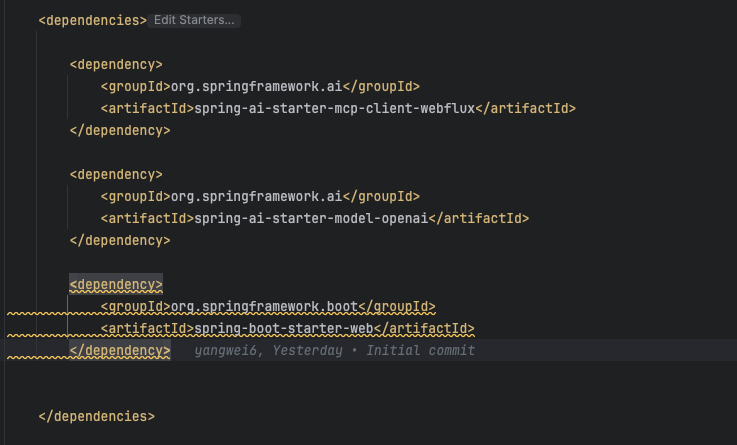

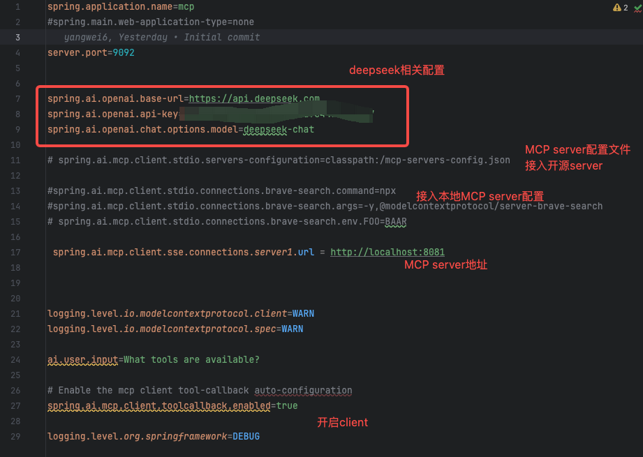

2. 构建chatClient
   - model有个默认绑定chatClient；
   - 手动注入工具，并绑定chatClient；

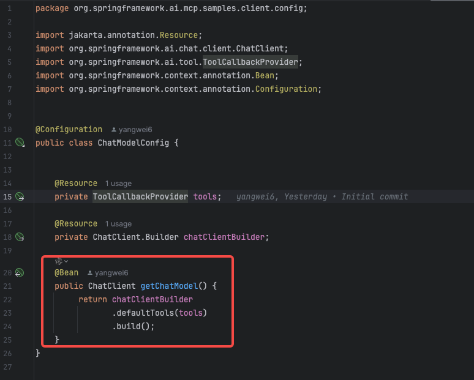

   - chat接口编码

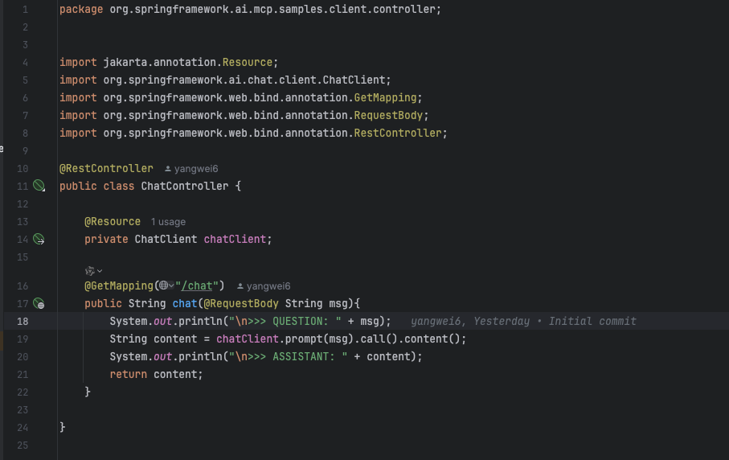

3. 验证：
   1. 启动mcp server；
   2. 启动Host（LLM+client及上下文环境）

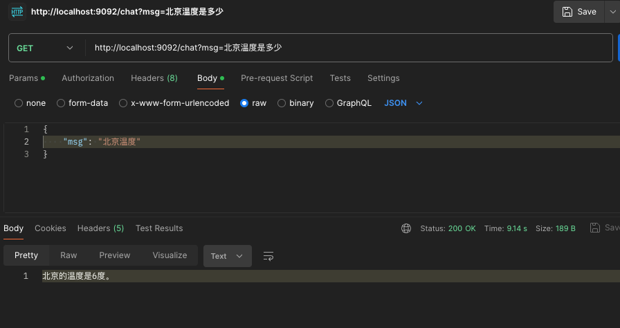

# 三、源码

1. [Python sdk实现源码](https://github.com/yangwei2future/mcp-python-sdk)
2. Java SDK源码：
   1. 自定义MCP server源码：
      1. [本地MCP server](https://github.com/yangwei2future/MCP-server)
      2. [SSE（远程）MCP server](https://github.com/yangwei2future/mcp-server-sse)
   2. [LLM接入自定义MCP client和server](https://github.com/yangwei2future/starter-webflux-client)
