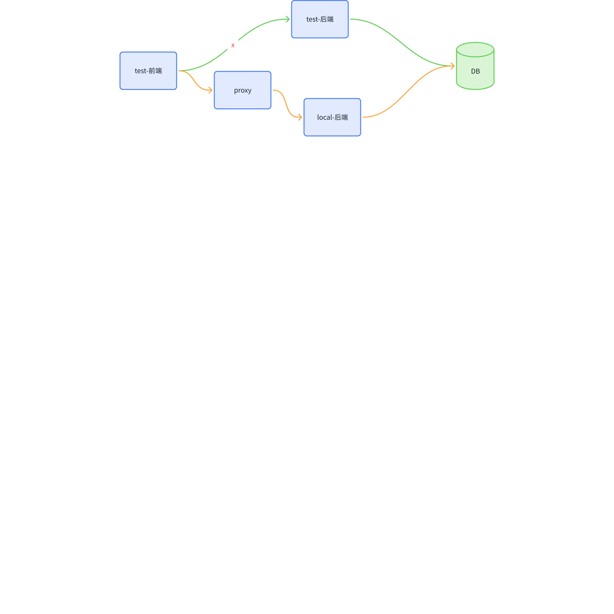
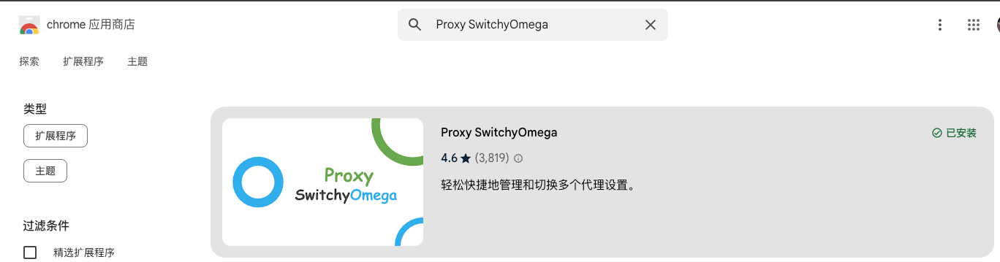
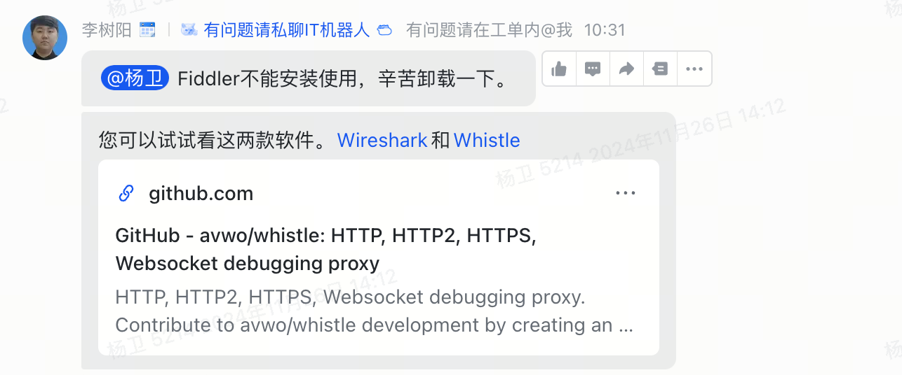
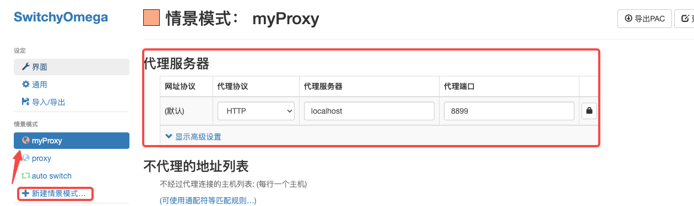
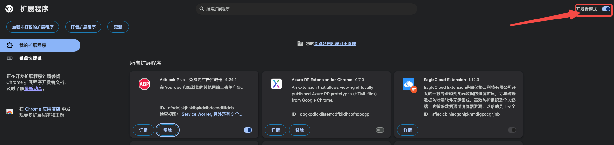
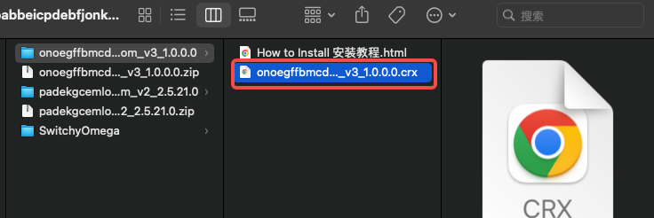
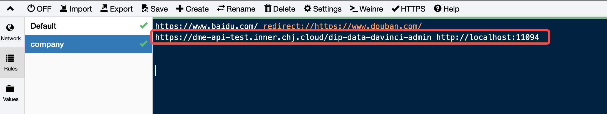
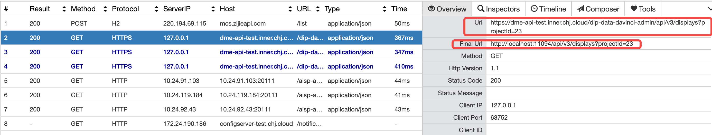

# 痛点场景

test环境调试过程，你是不是每次都将对应的curl请求复制到Postman中，然后修改域名至本地进行逐接口调试。验证完成之后，再把代码发到test环境进行验证。**此过程费时费力！！！**

是否有一种办法，可以直接把网页的请求，映射到本地新起的服务，然后进行调试呢。答案显然是可以的。

# 原理图



# 借助工具

**SwitchyOmega + whistle**

- **SwitchyOmega** 是一个谷歌的浏览器插件，可以将浏览器的请求根据规则匹配的方式，路由到对应的代理服务器。
- **whistle** 在我们的场景下，充当一个代理服务器，接收到请求之后，将对应的url替换成本地。

# 操作步骤

1. 安装 **SwitchyOmega** 插件，在谷歌扩展程序商店搜索即可下载。



2. 安装 **whistle** 程序，开源软件，公司推荐使用。

安装步骤【mac推荐一键安装】：https://github.com/avwo/whistle?tab=readme-ov-file



3. 启动 **whistle** 程序

```plaintext
# 控制台输入下方命令即可
w2 start
```

4. 配置 **SwitchyOmega** 插件，将目标的浏览器请求拦截，并转发到代理服务器。



5. 本地安装 **SwitchyOmega** 插件，下载安装包并解压（附件见飞书原文档）。

打开开发者模式后，将解压后 `*.crx` 文件拖入页面即可完成安装，其余配置按步骤4操作即可。





6. 配置 **whistle** 转发规则，将请求映射成我们的目标请求。



7. 验证是否生效



---

至此，痛点解决。
