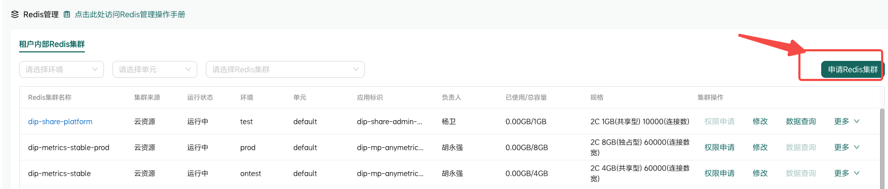
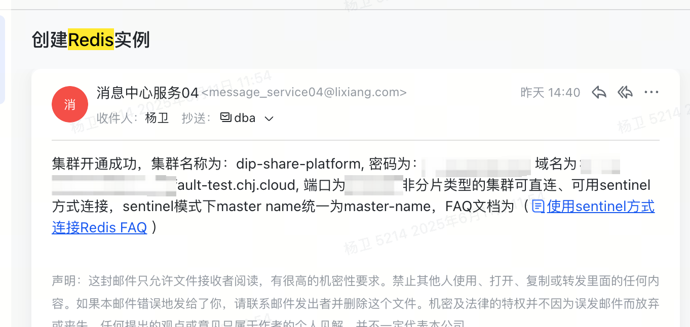

# 依赖配置

```xml
<dependency>
    <groupId>org.springframework.boot</groupId>
    <artifactId>spring-boot-starter-data-redis</artifactId>
</dependency>

<!-- Apache Commons Pool2 - Redis连接池必需依赖 -->
<dependency>
    <groupId>org.apache.commons</groupId>
    <artifactId>commons-pool2</artifactId>
    <version>2.11.1</version>
</dependency>
```

# 申请集群资源

1. 去融合云申请Redis集群（test环境不需要审批）；



2. 申请成功会收到一份邮件通知



# Apollo配置

将邮件中的配置信息，加入到Apollo中，方便服务启动时获取：

```properties
# redis信息
spring.redis.host = dip-share-platform-default-test.chj.cloud
spring.redis.port = 16379
spring.redis.password = _AadV)Alx2mM
spring.redis.database = 0
spring.redis.timeout = 6000ms
# 连接池配置
spring.redis.lettuce.pool.max-active = 8
spring.redis.lettuce.pool.max-idle = 8
spring.redis.lettuce.pool.min-idle = 0
spring.redis.lettuce.pool.max-wait = -1ms

# redis缓存过期时间-单位/分钟
dip.database.cache.expire = 10
```

# 编写配置 & 工具类

## 配置类

```java
package com.chehejia.share.admin.configuration;

import com.fasterxml.jackson.annotation.JsonAutoDetect;
import com.fasterxml.jackson.annotation.PropertyAccessor;
import com.fasterxml.jackson.databind.ObjectMapper;
import org.springframework.cache.CacheManager;
import org.springframework.cache.annotation.EnableCaching;
import org.springframework.context.annotation.Bean;
import org.springframework.context.annotation.Configuration;
import org.springframework.data.redis.cache.RedisCacheConfiguration;
import org.springframework.data.redis.cache.RedisCacheManager;
import org.springframework.data.redis.connection.RedisConnectionFactory;
import org.springframework.data.redis.core.RedisTemplate;
import org.springframework.data.redis.serializer.Jackson2JsonRedisSerializer;
import org.springframework.data.redis.serializer.StringRedisSerializer;

import java.time.Duration;

@Configuration
@EnableCaching
public class RedisConfig {

    @Bean
    public RedisTemplate<String, Object> redisTemplate(RedisConnectionFactory connectionFactory) {
        RedisTemplate<String, Object> template = new RedisTemplate<>();
        template.setConnectionFactory(connectionFactory);

        // 配置序列化方式
        Jackson2JsonRedisSerializer<Object> jackson2JsonRedisSerializer = new Jackson2JsonRedisSerializer<>(Object.class);
        ObjectMapper om = new ObjectMapper();
        om.setVisibility(PropertyAccessor.ALL, JsonAutoDetect.Visibility.ANY);
        // Jackson 2.9及以下版本使用这种方式
        om.enableDefaultTyping(ObjectMapper.DefaultTyping.NON_FINAL);
        jackson2JsonRedisSerializer.setObjectMapper(om);

        // 设置序列化器
        StringRedisSerializer stringRedisSerializer = new StringRedisSerializer();
        template.setKeySerializer(stringRedisSerializer);
        template.setHashKeySerializer(stringRedisSerializer);
        template.setValueSerializer(jackson2JsonRedisSerializer);
        template.setHashValueSerializer(jackson2JsonRedisSerializer);

        template.afterPropertiesSet();
        return template;
    }

    @Bean
    public CacheManager cacheManager(RedisConnectionFactory connectionFactory) {
        RedisCacheConfiguration config = RedisCacheConfiguration.defaultCacheConfig()
                .entryTtl(Duration.ofMinutes(60))  // 设置缓存过期时间
                .disableCachingNullValues();       // 不缓存null值

        return RedisCacheManager.builder(connectionFactory)
                .cacheDefaults(config)
                .build();
    }
}
```

## 工具类

```java
package com.chehejia.share.admin.service.impl;

import org.springframework.beans.factory.annotation.Autowired;
import org.springframework.data.redis.core.RedisTemplate;
import org.springframework.stereotype.Service;

import java.util.concurrent.TimeUnit;

@Service
public class RedisService {

    @Autowired
    private RedisTemplate<String, Object> redisTemplate;

    // 存储值
    public void set(String key, Object value) {
        redisTemplate.opsForValue().set(key, value);
    }

    // 存储值并设置过期时间
    public void setWithExpire(String key, Object value, long timeout, TimeUnit unit) {
        redisTemplate.opsForValue().set(key, value, timeout, unit);
    }

    // 获取值
    public Object get(String key) {
        return redisTemplate.opsForValue().get(key);
    }

    // 删除
    public Boolean delete(String key) {
        return redisTemplate.delete(key);
    }

    // 判断key是否存在
    public Boolean hasKey(String key) {
        return redisTemplate.hasKey(key);
    }
}
```

# 接口验证

```java
/**
 * 测试缓存功能 - 获取数据库连接信息（带缓存）
 *
 * @param mappingName 数据库映射名称
 * @param spaceCode 空间代码（可选）
 * @return 数据库连接信息
 */
@GetMapping("/cache-test")
@ApiOperation(value = "测试缓存功能", notes = "测试Redis缓存的数据库连接信息获取")
public ResponseEntity<Map<String, Object>> testCacheFunction(
        @ApiParam(value = "数据库映射名称", required = true, example = "mysql_dip_stat")
        @RequestParam("mappingName") String mappingName,
        @ApiParam(value = "空间代码", required = false, example = "dip_pf")
        @RequestParam(value = "spaceCode", required = false) String spaceCode) {

    log.info("接收到缓存测试请求，mappingName: {}, spaceCode: {}", mappingName, spaceCode);

    Map<String, Object> result = new HashMap<>();

    try {
        long startTime = System.currentTimeMillis();

        // 第一次调用 - 应该从API获取并缓存
        DatabaseConnectionInfo connectionInfo1;
        if (spaceCode != null && !spaceCode.trim().isEmpty()) {
            connectionInfo1 = databaseAuthUtils.getDatabaseConnectionInfo(mappingName, spaceCode);
        } else {
            connectionInfo1 = databaseAuthUtils.getDatabaseConnectionInfo(mappingName);
        }
        long firstCallTime = System.currentTimeMillis();

        // 第二次调用 - 应该从缓存获取
        DatabaseConnectionInfo connectionInfo2;
        if (spaceCode != null && !spaceCode.trim().isEmpty()) {
            connectionInfo2 = databaseAuthUtils.getDatabaseConnectionInfo(mappingName, spaceCode);
        } else {
            connectionInfo2 = databaseAuthUtils.getDatabaseConnectionInfo(mappingName);
        }
        long secondCallTime = System.currentTimeMillis();

        result.put("success", true);
        result.put("message", "缓存功能测试成功");
        result.put("data", connectionInfo1);
        result.put("firstCallTime", (firstCallTime - startTime) + "ms");
        result.put("secondCallTime", (secondCallTime - firstCallTime) + "ms");
        result.put("speedImprovement",
                String.format("%.2fx", (double)(firstCallTime - startTime) / (secondCallTime - firstCallTime)));
        result.put("cacheWorking", connectionInfo1.equals(connectionInfo2) &&
                (secondCallTime - firstCallTime) < (firstCallTime - startTime));

        log.info("缓存功能测试完成，第一次调用: {}ms, 第二次调用: {}ms",
                firstCallTime - startTime, secondCallTime - firstCallTime);

        return ResponseEntity.ok(result);

    } catch (Exception e) {
        log.error("缓存功能测试失败，mappingName: {}, spaceCode: {}", mappingName, spaceCode, e);

        result.put("success", false);
        result.put("message", "缓存功能测试失败: " + e.getMessage());
        result.put("error", e.getClass().getSimpleName());

        return ResponseEntity.status(500).body(result);
    }
}

/**
 * 清除指定数据库的缓存
 *
 * @param mappingName 数据库映射名称
 * @param spaceCode 空间代码（可选）
 * @return 操作结果
 */
@DeleteMapping("/cache")
@ApiOperation(value = "清除缓存", notes = "清除指定数据库映射名称的缓存")
public ResponseEntity<Map<String, Object>> clearCache(
        @ApiParam(value = "数据库映射名称", required = true, example = "mysql_dip_stat")
        @RequestParam("mappingName") String mappingName,
        @ApiParam(value = "空间代码", required = false, example = "dip_pf")
        @RequestParam(value = "spaceCode", required = false) String spaceCode) {

    log.info("接收到清除缓存请求，mappingName: {}, spaceCode: {}", mappingName, spaceCode);

    Map<String, Object> result = new HashMap<>();

    try {
        if (spaceCode != null && !spaceCode.trim().isEmpty()) {
            databaseAuthUtils.clearCache(mappingName, spaceCode);
        } else {
            databaseAuthUtils.clearCache(mappingName);
        }

        result.put("success", true);
        result.put("message", "缓存清除成功");
        result.put("mappingName", mappingName);
        result.put("spaceCode", spaceCode);

        log.info("缓存清除成功，mappingName: {}, spaceCode: {}", mappingName, spaceCode);

        return ResponseEntity.ok(result);

    } catch (Exception e) {
        log.error("清除缓存失败，mappingName: {}, spaceCode: {}", mappingName, spaceCode, e);

        result.put("success", false);
        result.put("message", "清除缓存失败: " + e.getMessage());
        result.put("error", e.getClass().getSimpleName());

        return ResponseEntity.status(500).body(result);
    }
}
```
