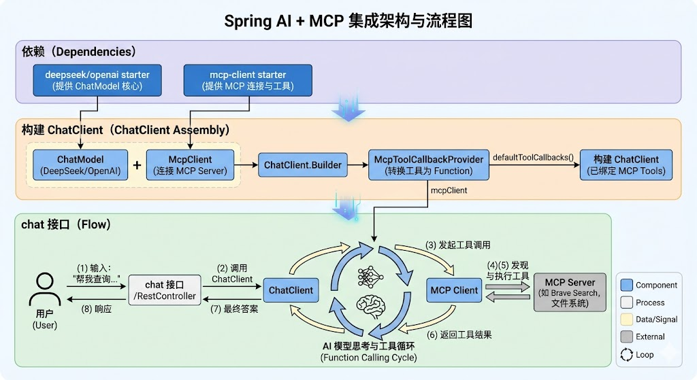
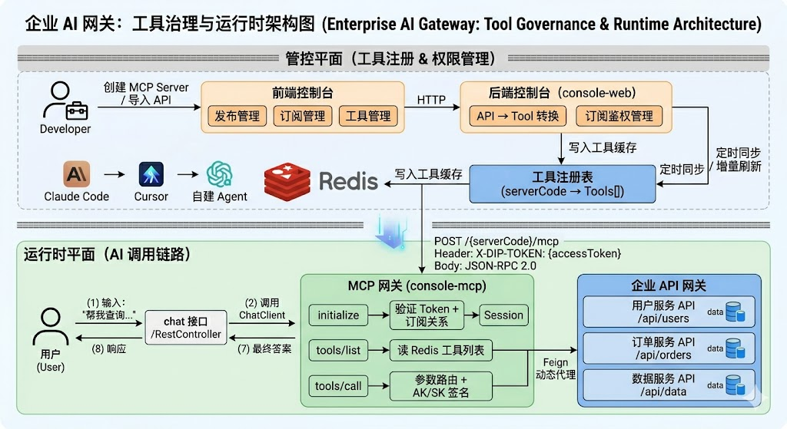

# MCP 全景：从协议原理到企业级落地

> 本文整合 MCP 协议背景、实践接入与企业级架构三个维度，提供从"Why"到"How"到"Production"的完整视角。

---

## 一、为什么需要 MCP？

### 对话能力的三个阶段

| 阶段 | 特征 | 痛点 |
|------|------|------|
| **对话 1.0**（ChatGPT 时代） | LLM 强大但孤立，只能处理静态知识 | 无法获取实时数据 |
| **对话 2.0**（Function Calling） | 外层工程化，将实时信息作为 Prompt 输入 | 工具与模型**定制耦合**，复用难，升级需整体重部署 |
| **对话 2.1**（MCP） | 标准化协议，Client/Server 分离，独立部署 | — |

MCP 的核心价值：**解耦工具和模型**。工具变更或升级，模型服务无需调整，自动获得新能力。

---

## 二、什么是 MCP？

**MCP（Model Context Protocol，模型上下文协议）**，2024 年 11 月由 Anthropic 推出的开放标准，统一 LLM 与外部数据源/工具之间的通信协议。

### 核心概念


| 形象比喻 | 整体结构图 |
|---------|---------|
|  |  |

- **Host**：宿主应用（IDE、Claude Desktop 等），可包含多个 Client
- **MCP Client**：一个 Client 只连接一个 Server，负责通信
- **MCP Server**：访问本地/远程数据源，向 Client 提供工具（Tools）和提示词（Prompts）

> Client 和 Server 是逻辑概念，官方 SDK 支持：Python、Node.js、Java、C#、Kotlin。

---

## 三、如何接入 MCP？

### 3.1 接入开源 MCP Server（零成本）

社区已有大量开源 MCP Server（[awesome-mcp-servers](https://github.com/punkpeye/awesome-mcp-servers)），接入方式两种：

1. **直接使用官方部署的 Server**：在 IDE MCP 配置中填入地址即可（如文件系统 MCP）
2. **编译本地 Server**：下载源码编译成可执行文件，写入 MCP 配置（如 apple-script MCP，可对话控制 macOS 打开应用）

### 3.2 自定义 MCP Server

#### 本地 Server（Stdio 通信）

基于 Spring AI + MCP Java SDK：

```
1. 创建 Spring 脚手架项目
2. 引入依赖：spring-ai-starter-mcp-server + spring-web
3. 调整配置文件（禁用 web server，启用 stdio transport）
4. 创建 Service，业务方法标注 @Tool
5. 创建 ToolProvider，注册 Tool
6. mvn package 打包为 jar
```

接入 IDE（以 cherry-studio 为例，cursor 不支持 Java Server）：
```json
{
  "mcpServers": {
    "my-server": {
      "command": "java",
      "args": ["-jar", "/path/to/server.jar"]
    }
  }
}
```

#### 远程 Server（SSE 通信）

相比本地 Server，只需调整依赖：
- 替换为 `spring-ai-starter-mcp-server-webmvc`
- 去除原 spring-web-mvc 依赖

IDE 配置：类型选 SSE，URL 填 `{服务地址}/sse`。

### 3.3 LLM 接入自定义 MCP Client

> 场景：不依赖某个 IDE，自建 AI 应用时需要自定义 Client。



---

## 四、MCP 企业级落地：MCP 市场

> 场景：企业内部有大量已有 REST API，如何让 AI 安全、可控地调用？

### 4.1 整体架构

系统分为两个平面：**管控平面**（发布/订阅/工具管理）和**运行时平面**（AI 实际调用链路）。




### 4.2 三大核心流程

#### 发布流程：REST API → MCP Tool

```
开发者创建 MCP Server 应用
  → 从已发布 API 中选择导入（仅 status=3 且 isOnline=1 的 API）
    → ApiToMcpToolConverter 自动生成 JSON Schema
      → 刷新 Redis 工具缓存
```

Tool 命名规则：`{serverCode}_{apiPath}_{httpMethod}`，例如：
```json
{
  "name": "data_svc_api_v1_users_get",
  "description": "查询用户信息",
  "inputSchema": {
    "type": "object",
    "properties": {
      "userId": { "type": "integer", "description": "用户ID" }
    },
    "required": ["userId"]
  }
}
```

#### 订阅流程

```
订阅方应用 → applySubscription(subscribeAppId, publishMappingPath)
  → 写入授权记录（当前 P0 直接授权，可扩展为审批流）
    → 订阅方获得 MCP Endpoint + AccessToken
```

#### 调用流程：AI → MCP Gateway → 企业 API

```
AI 客户端 POST /{serverCode}/mcp
  + Header: X-DIP-TOKEN: {accessToken}
  + Body: JSON-RPC 2.0
         │
    initialize  → 验证 Token + 验证订阅关系 → 创建 Session
    tools/list  → 从 Redis 读取工具列表
    tools/call  → 解析参数 → AK/SK 签名 → Feign 调用下游 API → 返回结果
```

### 4.3 关键设计亮点

| 设计点 | 方案 |
|--------|------|
| **零侵入接入** | 已有 REST API 一键导入为 Tool，JSON Schema 自动生成 |
| **多实例一致性** | Redis 工具缓存 + 定时全量同步（间隔 Apollo 配置） |
| **弹性刷新** | 全量刷新（定时）+ 增量刷新（工具变更触发） |
| **细粒度鉴权** | Session 级鉴权 + 订阅关系校验 + 订阅方 Token 透传下游 |
| **配置化** | 刷新间隔、网关地址、AK/SK 全走 Apollo，支持热更新 |

---

## 五、其他落地案例

### 案例一：AI IDE 接入飞书 MCP，技术方案直接指导编码

**痛点**：技术方案文档格式不兼容 IDE、手动维护同步滞后、PDF 读取失败。

**方案**：接入飞书 MCP，让 IDE 直接读取飞书文档内容。

**效果**：
- 文档中的约束信息（字段规则、业务逻辑）被模型感知并集成到代码实现
- 流程图/时序图中的接口逻辑，直接指导代码生成
- 文档更新实时同步，无需手动维护

### 案例二：开放平台接入飞书 MCP，文档即 API

**痛点**：新建接口需手动录入，效率低、易出错，且无法处理需权限的飞书文档。

**演进**：
- 一期：网页爬取 + 大模型提取（不稳定，不支持权限文档）
- **二期**：Agent 模式接入飞书 MCP → 直接获取文档内容 → 自动解析接口信息填入表单

### 案例三：MCP 封装 RAG 能力

**场景**：NL2SQL 链路中，向量召回能力封装成 MCP Tool。

**优势**：Agent 自行评估是否需要召回、召回多少，比固定单次召回更灵活，兼顾速度与准确率。

---

## 六、总结

```
MCP 协议
  ├── 解决了什么：AI 与工具的标准化互联，解耦工具和模型
  ├── 三要素：Host / MCP Client / MCP Server
  ├── 接入路径：开源 Server → 自定义 Server（Stdio/SSE）→ 自定义 Client
  └── 企业落地：MCP 市场 = 发布订阅体系 + 协议网关 + 权限管控
                把已有 API 资产平滑延伸到 AI 工具调用领域
```

核心原则：**渐进式扩展，而非推倒重来**。在现有 API 基础设施上增加一层 MCP 协议适配，最小成本换取 AI 接入能力。

---

**参考资料**
- [MCP 官方开发文档](https://modelcontextprotocol.io/quickstart/server)
- [MCP Java SDK](https://github.com/modelcontextprotocol/java-sdk)
- [Spring AI 集成 MCP 文档](https://docs.spring.io/spring-ai/reference/api/mcp/mcp-server-boot-starter-docs.html)
- [awesome-mcp-servers 社区](https://github.com/punkpeye/awesome-mcp-servers)
