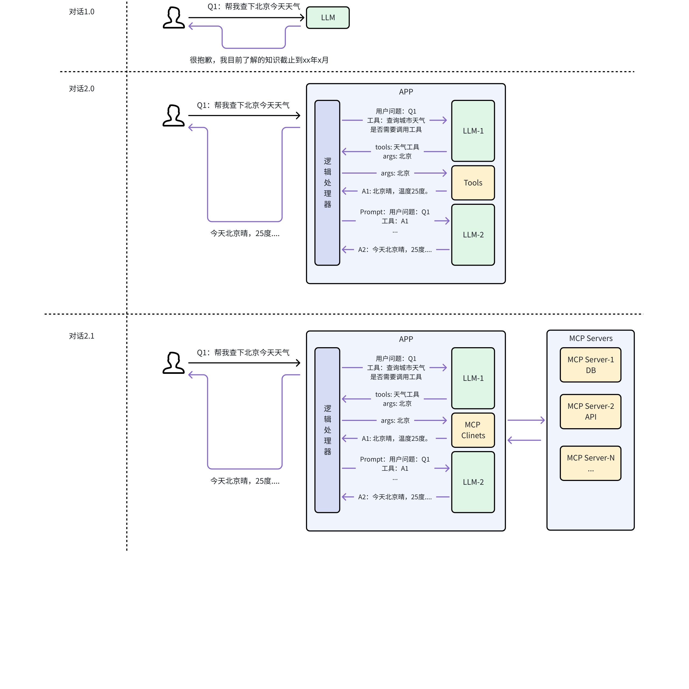
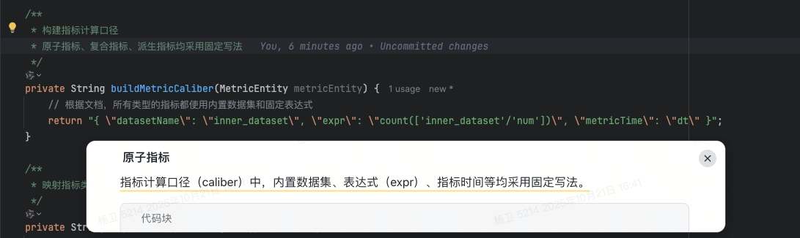
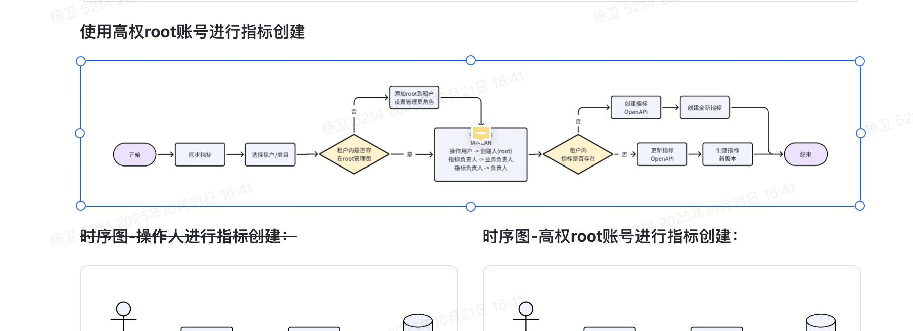
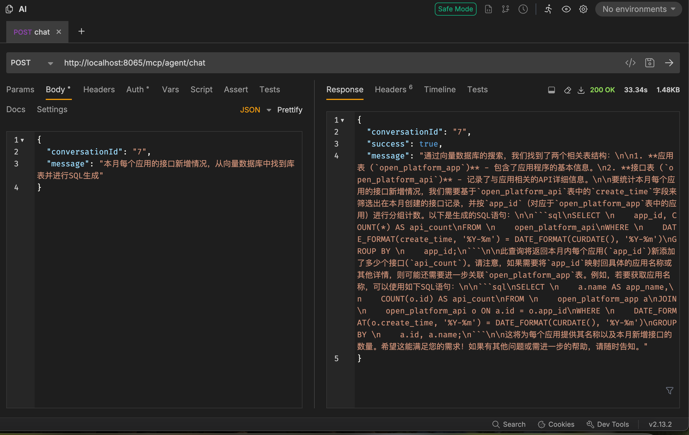
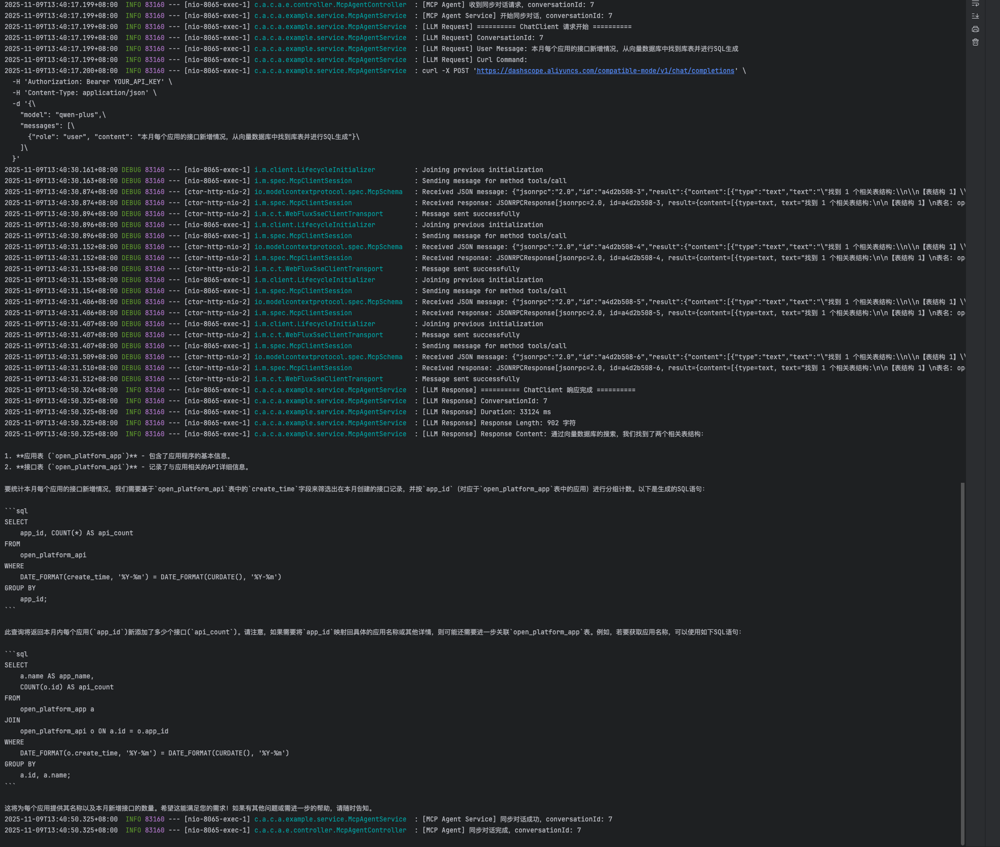
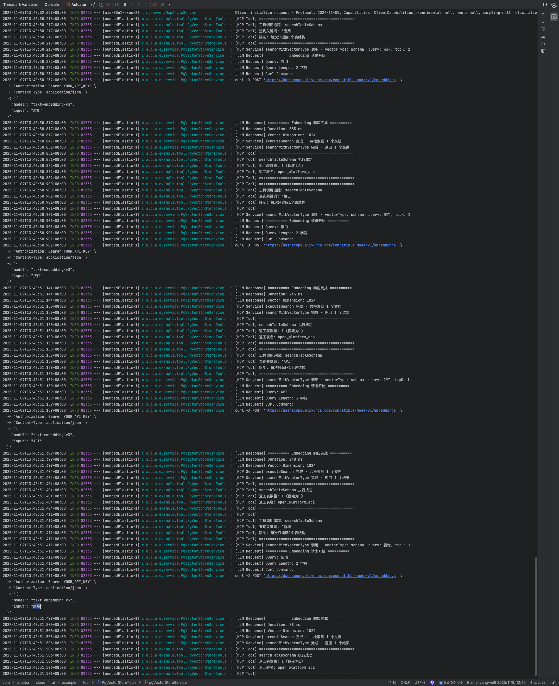

> 预期收益：
> 1. Why MCP：为什么需要MCP？
> 2. What MCP：什么是MCP？它做了什么事？
> 3. How MCP：如何接入或自建MCP。

# 一、Why MCP

> 要成为真正高效的智能体，大语言模型不仅要能生成文本，更需要与外部环境互动，比如实时获取数据或调用各种软件功能。如果没有统一规范的交流方式，每次让大语言模型连接新工具或数据源都得单独定制，既复杂又难以复用。这种杂乱无章的方法既难以扩展，也让搭建大规模、互联的 AI 系统变得既耗时又低效。

那为什么现在业界主要使用的是MCP呢？我们可以从 `图1` 的几个对话场景来分析出几个关键要点。

1. 在 `对话1.0` 阶段，也是ChatGPT3刚开始轰动业界时，虽然LLM能力强大，但无法获取实时数据。
2. 在 `对话2.0` 阶段，可以理解为 `function calling` 技术出现后的技术路径，通过让模型自主判断是否需要工具，并通过LLM外层工程化的方式，将实时信息获取，并作为Prompt一部分输入给模型。
   1. 优势：解决了模型无法获取实时数据的痛点；
   2. 劣势：
      1. 工具与模型之间处于定制关系，复用难度大；
      2. 工具与模型耦合严重，若工具有调整或新增能力，需要整体重新部署；
3. 在 `对话2.1` 阶段，模型与工具之间的沟通方式被标准化，沉淀出了MCP协议。
   1. 核心：拆分成Client和Server，分别负责请求和响应，独立部署；
   2. 好处：
      1. 解耦工具和模型，无需代码层强耦合；
      2. 工具变更或升级，无需模型服务调整，自动获得工具升级收益；

# 二、What MCP

MCP（Model Context Protocol，模型上下文协议），2024年11月底，由 **Anthropic** 推出的一种开放标准，旨在统一大型语言模型（LLM）与外部数据源和工具之间的通信协议。MCP 的主要目的在于解决当前 AI 模型因数据孤岛限制而无法充分发挥潜力的难题，MCP 使得 AI 应用能够访问和操作本地及远程数据，为 AI 应用提供了连接万物的接口。

| 形象比喻 | 整体结构图 |
|---------|---------|
|  |  |

## 核心概念

1. **Host**：一个应用（主机）（可能是IDE, Claude Desktop等类型）可以包含多个客户端；
2. **MCP Client**：一个客户端只会连接一个服务器，通过mcp协议交互；
3. **MCP Server**：服务端可以访问本地/远程数据源，提供工具和提示词给客户端

> 注意：client和server是一个逻辑概念，它们的实现不局限于编程语言，目前MCP协议官方提供Python、Node.js、Java、C#、Kotlin的SDK。

# 三、How MCP

> 在此之前，已经做过MCP相关实践并沉淀了文档，详情可移步文档自行阅读：[MCP使用实践](../MCP使用实践/MCP使用实践.md)
> 1. AI IDE接入开源的MCP Server；
> 2. 自定义 MCP Server：
>    1. Stdio形式（本地Server）
>    2. SSE形式（远程server）
> 3. LLM接入自定义MCP Server及Client；

# 四、使用案例

## AI IDE接入飞书MCP，技术方案 → 编码

> 详细接入指南可移步文档：AI IDE-接入飞书OpenAPI MCP教程

**背景**

在AI Coding过程中，通常的做法是把技术方案文档到项目中，并在与模型（此处代指cursor、GitHub Copilot、CodeFactory等IDE）对话过程中，引用技术方案作为辅助资料，同时写入接口定义、库表schema信息和约束规则进行代码生成，后续再进行人工检查、接口自测等工作。

**思考**

在对话过程中输入的接口定义、库表schema信息在技术方案中均有完整的体现，一些复杂的接口的逻辑设计在技术方案中也会有详细的说明（需要评审），这些正是指导代码生成的关键原料。仅将技术方案作为一个外挂的辅助材料，似乎没有完全发挥它的作用，是否可以直接让技术方案来直接指导编码实现？？

面临的问题：
1. IDE对pdf的格式支持不太好，读取失败；
2. 直接将技术方案（飞书文档）复制到项目新建的.md文件，两边的格式未对齐，IDE中的可阅读性差；
3. 技术方案调整之后，项目内的文件更新不及时；

**尝试方案：将飞书文档和模型打通，杜绝中间商！！！**

**效果**

1. Coding过程中，模型并非仅关注接口定义本身，文档其他位置的约束信息也能被关注并集成到代码实现中。

2. 接口的实现逻辑在"流程图"和"时序图"中，生成的实现代码参照上述逻辑进行了实现；

## 开放平台接入飞书MCP，文档即API

**背景**

开放平台新建接口时，如果没有Swagger文档，那么你面临的是参照现有的接口文档，一个个录入接口信息。不仅效率低、耗时长而且极容易出错。

**思考**

智能导入一期：通过渲染网页 + 信息爬取的方式，获取URL中的内容，将其喂入大模型进行信息提取；

遗留问题：
1. 无法获取带权限文档内容，而当前使用最多的是飞书文档；
2. 渲染网页 + 信息爬取不稳定，对网页布局有要求；
3. 耗时长；

智能导入二期：通过agent模式，接入飞书MCP工具获取文档内容；

**效果**

> 视频：1292f6d4-c4d2-4c75-baeb-8751a46dfcfc.mp4（见飞书原文档）

## 利用MCP封装RAG能力

**背景**

共享平台通过SQL的方式，将数仓库表信息转换成一个个可用的API进行数据共享，本质是一个SQL2API的工具。从场景上识别为一个NL2SQL的典型场景，作为智能化的一环，搭建了一条NL2SQL链路，同时也识别了一些挑战。
1. 向量化模型选择、相似度计算方案；
2. 海量表情况下，召回信息方案（召回评估）；
3. 如何平衡生成速度和准确率；

**思考**

传统RAG链路：用户query → RAG召回（库表schema）→ SQL生成；
1. 传统方案为单次召回，是否一次召回是足够的？
2. 对库表schema信息做向量化落入时，对哪些信息做embedding有利于提升召回效果？
3. SQL生成准确率如何评估？
4. 使用Agent模式后，如何平衡速度和准确率？

**执行**

1. 向量召回能力封装成MCP，Agent自行评估是否需要召回以及召回多少内容；

简单效果展示：

| 生成结果 | 处理流程 | MCP Server调用日志 |
|---------|---------|-----------------|
|  |  |  |
