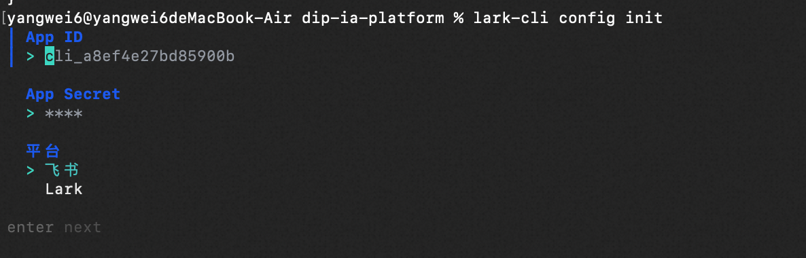
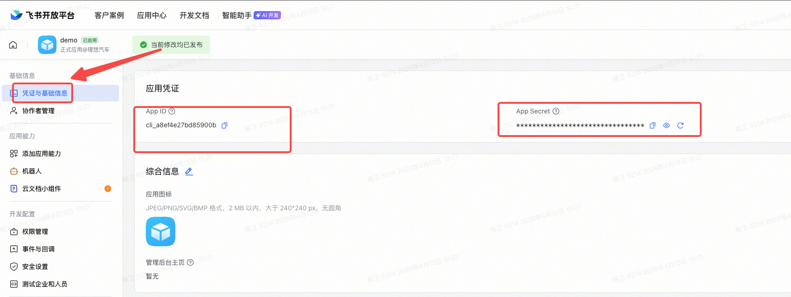
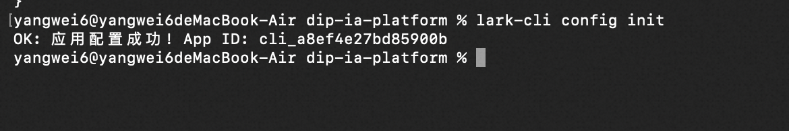
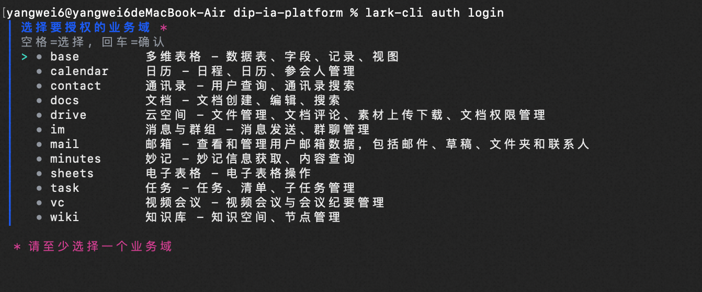
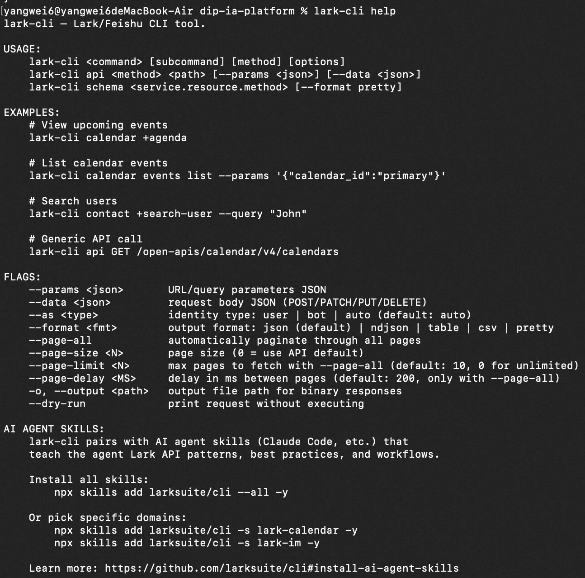
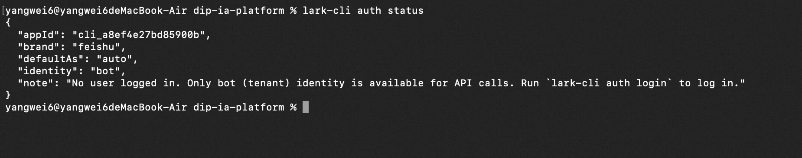
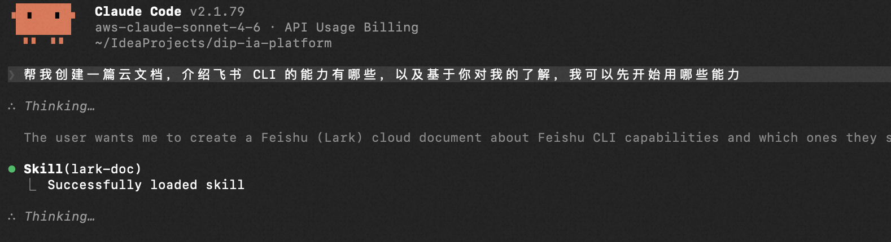

# 飞书CLI 快速安装与配置

### 环境要求

- Node.js 16.0 及以上版本
- npm 或 yarn

### 安装步骤

**第一步：安装 lark-cli**

将以下命令发送给 AI Agent 工具（如 Trae、Cursor、Codex、Claude code）：

```bash
npm install -g @larksuite/cli
```

**第二步：安装相关 Skills**

```bash
npx skills add https://github.com/larksuite/cli -y -g
```

**第三步：初始化应用配置**

```bash
# （推荐）手动配置应用的方式
lark-cli config init

# 默认新建应用的方式
lark-cli config init --new
```

配置过程中，默认会创建一个新应用，也可以选择一个已有应用。

> **注意**：为了确保 skills 完整加载，配置完成后需要**重启**你的 AI Agent 工具（如 Trae、Cursor、Codex、Claude code），然后便可以发送指令开始操作飞书。

---

开启初始化配置（不新建应用）：

```bash
lark-cli config init
```


手动输入应用凭证：








---

### 完成用户授权（可选）

飞书 CLI 支持两种工作模式：

- **不授权**：AI 仍可执行发消息、创建文档等操作，但无法访问你的个人数据（如日程、私信、收件箱）。
- **以你的身份操作**：AI 可以访问你的个人日历、消息、文档，并以你的名义执行操作。需要完成一次用户授权。

```bash
lark-cli auth login
```

执行命令后，打开链接在飞书中确认即可。如果暂时跳过，后续 AI 在需要访问你个人数据时，也会自动发起授权提示。

> 以下业务域，选择需要的即可（同时需要保障应用有业务域下的权限）



> **提示**：如果需要保持授权状态，请在开发者后台（安全设置 → 重定向 URL → 刷新 user_access_token）开启该能力。

### 验证安装

```bash
lark-cli help        # 查看命令总览
lark-cli auth status # 查看当前登录状态
```

与其他 cli 命令中的 `--help` 一致：



当前登录状态：



---

### 开启你的第一个任务

打开你的 AI Agent 工具（如 Trae、Cursor、Claude Code），在对话框中输入：

```
帮我创建一篇云文档，介绍飞书 CLI 的能力有哪些，以及基于你对我的了解，我可以先开始用哪些能力
```



执行结果：[飞书 CLI 能力总览 & 入门推荐](https://li.feishu.cn/docx/Dh10dCpQzodkxexcaCFcNVFtnjY)
